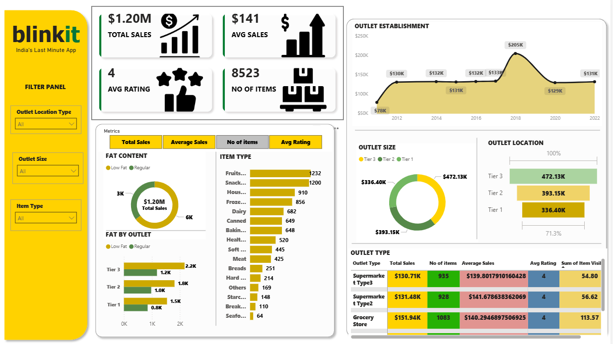

# 🛒 Blinkit Data Analytics Project

---

## 👩‍💻 About Me

| | |
|---|---|
| **Name** | Payal Jibhakate |
| **Email** | payaljibhakate2004@gmail.com |
| **LinkedIn** | [Connect with me](www.linkedin.com/in/payal-jibhakate) |

---

## 📌 Project Overview

This project presents a complete **Data Analytics solution for Blinkit**
(India's Last Minute Grocery Delivery App).

The analysis covers **sales performance, outlet efficiency, item categories,
and customer ratings** using real-world grocery data.

---

## 🎯 Objective

> To analyze Blinkit's sales data and generate actionable business insights
> using **SQL**, **Power BI**, and **Data Visualization** techniques.

---

## 🛠️ Tools & Technologies

| Tool | Purpose |
|---|---|
| **Power BI** | Interactive Dashboard & Visualization |
| **SQL** | Data Querying & Analysis |
| **MS Word** | Documentation & Reporting |
| **Excel/CSV** | Raw Data Handling |
| **GitHub** | Version Control & Portfolio |

---

## 📁 Project Structure
Blinkit-Data-Analytics/
│
├── 📁 dataset/          → Raw data files
├── 📁 sql/              → SQL queries document
├── 📁 dashboard/        → Power BI (.pbix) file
├── 📁 screenshots/      → Dashboard preview images
├── 📁 documentation/    → Analysis report (PDF)
└── 📄 README.md         → Project documentation

---

## 🔄 Project Workflow

**Step 1 →** Collected and cleaned Blinkit grocery sales data

**Step 2 →** Wrote SQL queries to explore and analyze the data

**Step 3 →** Built an interactive Power BI dashboard

**Step 4 →** Generated business insights and final report

---

## 📊 Dashboard Preview

---

## 💡 Key Business Insights

- 🏪 **Outlet Size Impact** — Medium sized outlets generate the highest sales
- 🥦 **Top Category** — Fruits & Vegetables and Snack Foods are top sellers
- ⭐ **Customer Ratings** — Average rating of 3.9 across all outlets
- 📍 **Location Tier** — Tier 3 cities contribute maximum total sales
- 📦 **Item Visibility** — Higher visibility items show better sales performance
- 🏬 **Outlet Type** — Supermarket Type 1 leads in overall revenue

---

## 📂 Files Included

| File | Description |
|---|---|
| `dataset/` | Raw Blinkit sales data |
| `sql/blinkit_analysis_queries.docx` | All SQL queries used |
| `dashboard/blinkit_dashboard.pbix` | Power BI dashboard file |
| `screenshots/blinkit_dashboard_preview.png` | Dashboard preview |
| | `documentation/` | Project analysis & insights documentation |
---

## 📬 Contact Payal Jibhakate

If you found this project helpful or want to collaborate:

📧 **Email:** payaljibhakate2004@gmail.com

🔗 **LinkedIn:** [Payal Jibhakate](www.linkedin.com/in/payal-jibhakate)

---

⭐ **If you like this project, please give it a Star on GitHub!** ⭐
